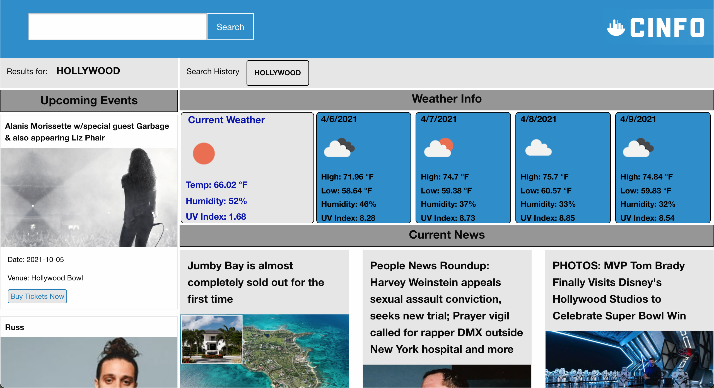

# Cinfo

 # About
The objective of this group project was to create an interactive application using at least two server-side APIs.

The high concept of the Cinfo web application is a simple solution answer to the question of what to do when you want to experience the life of the city. It is a streamlined events, arts, and culture aggregator focused towared metropolitan areas. It's designed to be used at home and on the go, with an unobtrusive design and user experience. 

The functional concept of Cinfo is very simple; A user enters a city and is returned with current events, arts, and culture information regarding that city

# Beta iteration of Cinfo and future development

The current beta version of Cinfo displays upcoming events in the screen left sidebar, based on city input. The screen right content area displays current news articles as well as a weather forecast based on city input. This iteration of Cinfo is exemplary of the pared down and unobtrusive user interface that future versions of Cinfo would attempt to maintain. Perserving the same general layout, future iterations of Cinfo would hope to include the following:

* Updated small, medium and large format design with more dynamic interface

* More robust data return for events and news relating to city events, arts, and culture with more search paramaters and search return sections

* Multiple API sources, for eg. Google, Yelp, YouTube, AirBnb.

* Flight and lodging data return

* Map integration with geolocation

# HTML

The HTML structure employs a simple layout with a sidebar on the screen left side containing data for current events. The screen right side contains current news articles, as well as a weather forecast. Card sections were structured in HTML, later to be created dynamically using jQuery, using only the HTML scaffolding for parent containers.

# CSS

The relative location of each area of the HTML layout (search header, screen left sidebar, screen right content) is designed using CSS Grid. Information cards are styled using the Foundation framework. Responsive design is dictated using both CSS Grid and Foundation framework.

# Javascript

API calls are made to Ticketmaster as well as Gnews using the Javascript fetch method. Data from API calls is formatted and placed in dynamically created cards in their respective event and news section using jQuery.

# Layout
The layout includes a user input city search bar and a website logo in the header. Content on events is displayed on the left with a forecast above displayed news.

5 day forecast detailing the current weather and the following 4 days. Details include a high temp, low temp, humidity, and UV index. Obtained through Open Weather API.

Next 10 upcoming events with information about the date, artist, venue and a link to purchase tickets on ticketmaster. Obtained through ticketmaster API.

9 most recent news articles about searched city including a title, detail photo, source, and link to read full article. Obtained through Gnews API.

# Links
Deployed Application: https://xavy-romeo.github.io/project-1-ucla/

Repository: https://github.com/Xavy-Romeo/project-1-ucla

# Technologies Used
HTML, Javascript, Jquery, CSS, Foundation Framework, Ticketmaster API, Open Weather API, Gnews API

# Team
Javier Vazquez  
Daniel Toomey  
Adam Bedingfield